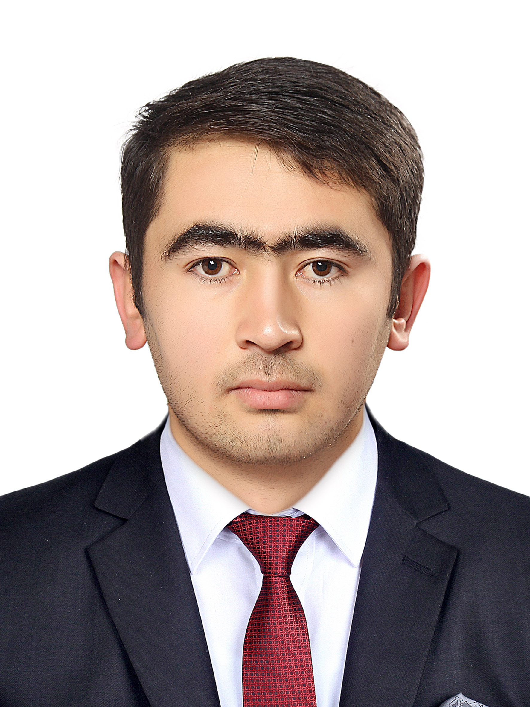

<a name="readme-top"></a>

<div align="center">
  <!-- You are encouraged to replace this logo with your own! Otherwise you can also remove it. -->
  
  <br/>

  <h3><b>Portfolio (Bootstrap)</b></h3>

</div>

<!-- TABLE OF CONTENTS -->

# 📗 Table of Contents

- [📗 Table of Contents](#-table-of-contents)
- [📖 \[Portfolio Bootstrap\] ](#-portfolio-bootstrap-)
  - [🛠 Built With ](#-built-with-)
    - [Tech Stack ](#tech-stack-)
    - [Key Features ](#key-features-)
  - [🚀 Live Demo ](#-live-demo-)
  - [💻 Getting Started ](#-getting-started-)
    - [Prerequisites](#prerequisites)
    - [Setup](#setup)
    - [Install](#install)
    - [Usage](#usage)
    - [Run tests](#run-tests)
    - [Deployment](#deployment)
  - [👥 Authors ](#-authors-)
  - [🔭 Future Features ](#-future-features-)
  - [🤝 Contributing ](#-contributing-)
  - [⭐️ Show your support ](#️-show-your-support-)
  - [🙏 Acknowledgments ](#-acknowledgments-)
  - [📝 License ](#-license-)

<!-- PROJECT DESCRIPTION -->

# 📖 [Portfolio Bootstrap] <a name="about-project"></a>

**[Portfolio Bootstrap]** is a full Bootstrap v5 based project that is done collaboratively with Aliza Amir.

## 🛠 Built With <a name="built-with"></a>

- [x] HTML
- [x] Bootstrap V5
- [x] CSS
- [x] Linters

### Tech Stack <a name="tech-stack"></a>

<details>
  <summary>Client</summary>
  <ul>
    <li><a href="https://reactjs.org/">React.js</a></li>
  </ul>
</details>

<details>
  <summary>Server</summary>
  <ul>
    <li><a href="https://expressjs.com/">Express.js</a></li>
  </ul>
</details>

<details>
<summary>Database</summary>
  <ul>
    <li><a href="https://www.postgresql.org/">PostgreSQL</a></li>
  </ul>
</details>

<!-- Features -->

### Key Features <a name="key-features"></a>

- ✅ **Responsive**
- ✅ **Home Section**
- ✅ **About me Section**
- ✅ **Work Section**
- ✅ **Conact me Section**

<p align="right">(<a href="#readme-top">back to top</a>)</p>

<!-- LIVE DEMO -->

## 🚀 Live Demo <a name="live-demo"></a>

- Live Demo isn't need now.

<p align="right">(<a href="#readme-top">back to top</a>)</p>

<!-- GETTING STARTED -->

## 💻 Getting Started <a name="getting-started"></a>

> Describe how a new developer could make use of your project.

To get a local copy up and running, follow these steps.

### Prerequisites

In order to run this project you need:

<!--
Example command:

```sh
 gem install rails
```
 -->

### Setup

Clone this repository to your desired folder:

Example commands:

```sh
  cd my-folder
  git clone https://github.com/M-Anwar-Hussaini/Portfolio_Bootstrap.git
```

### Install

Install this project with:

Example command:

```sh
  cd Portfolio_Bootstrap
  gem install
```

### Usage

To run the project, execute the `index.html` file from root directory:

<!--
Example command:

```sh
  rails server
```
--->

### Run tests

- ✅ Run tests aren't needed for now.

<!-- To run tests, run the following command: -->

<!--
Example command:

```sh
  bin/rails test test/models/article_test.rb
```
--->

### Deployment

- ✅ You can deploy this project using [this repository](https://github.com/M-Anwar-Hussaini/Portfolio_Bootstrap).

<!--
Example:

```sh

```
 -->

<p align="right">(<a href="#readme-top">back to top</a>)</p>

<!-- AUTHORS -->

## 👥 Authors <a name="authors"></a>

👤 **Mohammad Anwar Hussaini**

- ✅ GitHub: [@M-Anwar-Hussaini](https://github.com/M-Anwar-Hussaini/)
- ✅ Twitter: [@MAnwarHussaini](https://twitter.com/MAnwarHussaini)
- ✅ LinkedIn: [Mohammad Anwar Hussaini](https://www.linkedin.com/in/mohammad-anwar-hussaini-876638267/)

👤 **Aliza Amir**

- ✅ GitHub: [@Alizaamir123](https://github.com/alizaamir123/)
- ✅ LinkedIn: [Aliza Amir](https://www.linkedin.com/in/aliza-amir-545196215/)

<p align="right">(<a href="#readme-top">back to top</a>)</p>

<!-- FUTURE FEATURES -->

## 🔭 Future Features <a name="future-features"></a>

> Describe 1 - 3 features you will add to the project.

- [ ] **[Mobile first approach responsiveness]**
- [ ] **[Availabe on internet]**
- [ ] **[Interaction with end users]**

<p align="right">(<a href="#readme-top">back to top</a>)</p>

<!-- CONTRIBUTING -->

## 🤝 Contributing <a name="contributing"></a>

Contributions, issues, and feature requests are welcome!

Feel free to check the [issues page](https://github.com/M-Anwar-Hussaini/Portfolio_Bootstrap/issues).

<p align="right">(<a href="#readme-top">back to top</a>)</p>

<!-- SUPPORT -->

## ⭐️ Show your support <a name="support"></a>

If you like this project, please drop a **star** to [this repsitory](https://github.com/M-Anwar-Hussaini/Portfolio_Bootstrap).

<p align="right">(<a href="#readme-top">back to top</a>)</p>

<!-- ACKNOWLEDGEMENTS -->

## 🙏 Acknowledgments <a name="acknowledgements"></a>


I would like to thank the following individuals and organizations for their contribution to this project.
- ✅ [**Aliza Amir**](https://github.com/alizaamir123) for her collaboration and hardwordking to this project.
- ✅ [**Bootstrap**](https://getbootstrap.com/) for providing the most fantastic and easy to use **CSS** framework.
- ✅ [**Microvere**](https://www.microverse.org/?grsf=mohammad-a-nbtazu) for its arrangement and supports to all Micronauts and me.

<p align="right">(<a href="#readme-top">back to top</a>)</p>


<!-- LICENSE -->

## 📝 License <a name="license"></a>

This project is [MIT](MIT.md) licensed.
